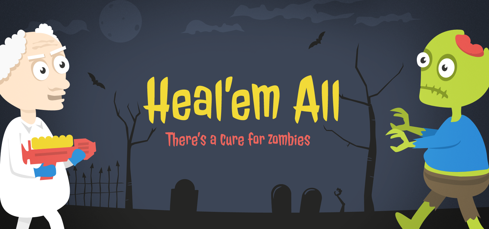
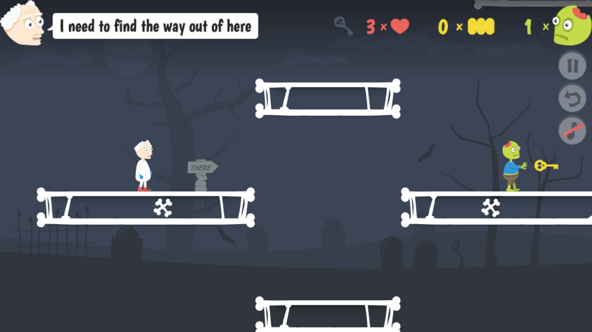

# Heal'em All

**There's a cure for zombies.**

Imagine the cure exists. The zombie plague can be stopped: explore an abandoned graveyard, heal as many zombies as you can, and find your way out. But be careful, or you will become one of them.

This is a remaster of the 2013 HTML5 game, rebuilt on **Phaser 4 + TypeScript + Vite**. The original art, audio and level data are carried over untouched; the engine, physics, input and UI are new.



## What's in the remake

- The original six levels, parsed from the same `.tmx` maps and using the original sprite atlases.
- Retuned platforming: coyote time, jump buffering, variable jump height and a double jump, so the original level layouts stay fun with modern feel.
- **Zombie Mode** - get bitten and play as the zombie until you are put down.
- Adaptive, full-bleed rendering: the game fills any window or phone screen with no letterbox bars, scaling the UI up on larger displays.
- Touch controls (D-pad plus jump/fire) and a rotate-to-landscape gate on phones.
- Keyboard navigation on every screen, a persistent doctor's hint line, and browser Back wired to the in-game menu hierarchy.
- Installable PWA with an offline cache and a service worker.

## Controls

| Action  | Keys                    |
| ------- | ----------------------- |
| Move    | Arrow keys or `A` / `D` |
| Jump    | Up arrow, `W` or `X`    |
| Shoot   | `Space` or `Z`          |
| Pause   | `P` (in a level)        |
| Mute    | `M`                     |
| Confirm | `Enter` / `Space`       |
| Back    | `Esc`                   |

On touch devices the on-screen controls appear automatically; append `?touch=1` to force them on a desktop for testing.

## Running it

Requires Node and [pnpm](https://pnpm.io/).

```bash
pnpm install
pnpm dev      # http://localhost:8080
```

| Command        | What it does                                         |
| -------------- | ---------------------------------------------------- |
| `pnpm dev`     | Vite dev server with HMR                             |
| `pnpm build`   | Type-check, then production build to `dist/`         |
| `pnpm preview` | Serve the production build locally                   |
| `pnpm check`   | Typecheck, lint, format check, tests and unused-code |
| `pnpm test`    | Vitest (co-located `src/**/*.test.ts`)               |

## How it's built

- `src/scenes/` - one Phaser scene per screen, plus `GameScene` (the level pipeline: map, entities, combat) and `HudScene` (counters and hints).
- `src/state/` - Phaser-free progress and run state in `store.ts`, with the event bus in `GameState.ts`.
- `src/ui/` - shared UI kit: `theme.ts` tokens, `layout.ts` menu frame, `buttons.ts` feedback, `navigation.ts` History integration, touch controls.
- `src/levels/` - the TMX parser and per-level spawn tables.

See `PLAN.md` for the migration phases and design pillars, and `AGENTS.md` for the architecture notes worth knowing before changing gameplay.

## Credits

Created by the original **Heal'em All** team:

- [Kris Urbas](https://twitter.com/krzysu) - programming, story
- [Pawel Madeja](https://twitter.com/pawelmadeja) - graphics

Thank you to the projects this stands on:

- [Quintus](http://html5quintus.com/) - the original JavaScript game engine
- [Phaser](https://phaser.io/) - the engine used by this remake
- [OpenGameArt](https://opengameart.org/) - the original audio

## License

This project is open source. The original game and its artwork were made by Kris Urbas and Pawel Madeja; the remake source is free to read, run, learn from and build upon.
